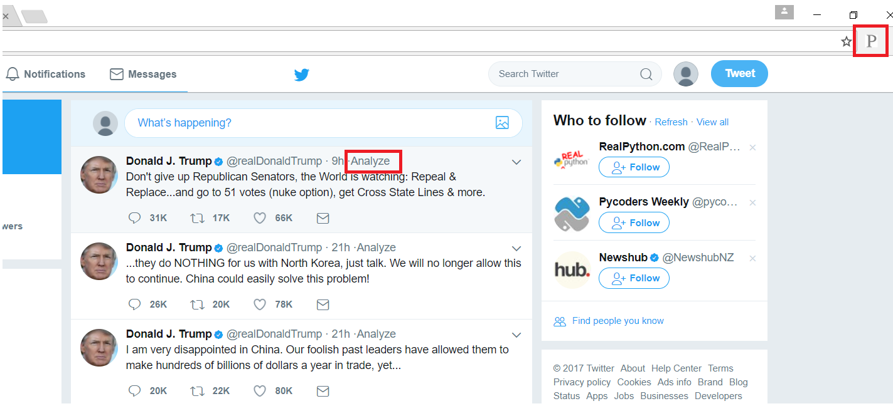

# Twitter-timeline-analysis

How to use:

1) Download the whole folder. 
2) Open Chrome. Choose Menu (far top right) -> More tools -> Extensions 
3) Click on "Developer mode" box. 
4) Choose "Loaded unpacked extension" and then directed to the downloaded folder. 
5) Open Twitter and use it. 

